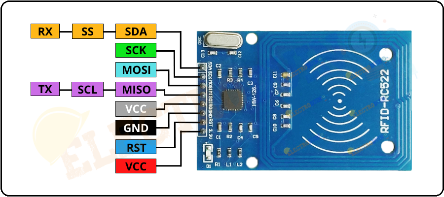
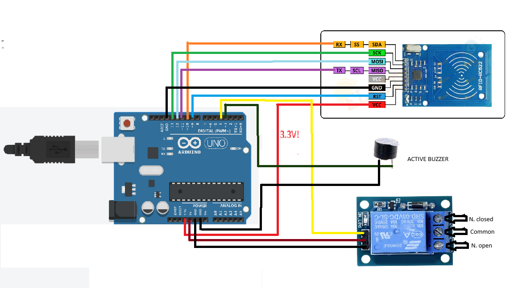
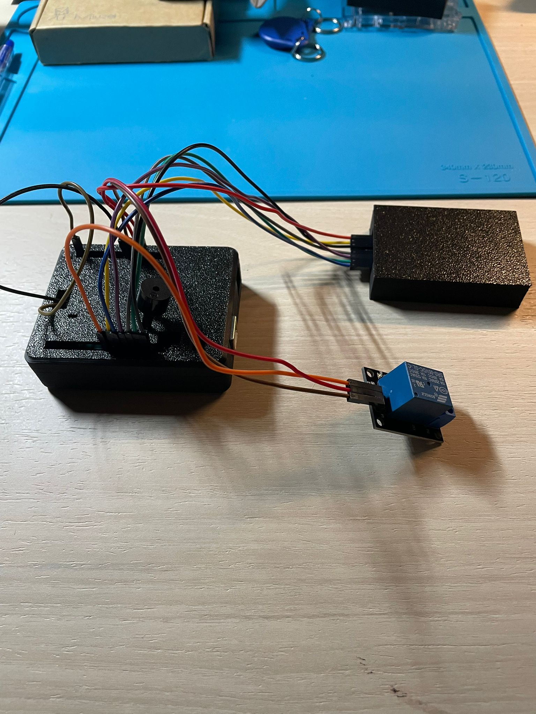

# Breccia-RFID-rc522

## Required Components
- Arduino board
- rc522 RFID module
- 1 or + MIFARE 1K Keys
- Relay module
- Active buzzer

*If you do not use a relay module, take care to include a diode and transistor in your circuit to prevent eddy currents from damaging the arduino board. In case you use a relay on a pre-fabricated board, then you will have no prob .*

## Connection diagram 

| RIFD | Arduino |
| ---- |---------|
| SDA  | D10     |
| SCK  | D13     |
| MOSI | D11     |
| MISO | D12     |
| GND  | GND     |
| RST  | 9       |
| VCC  | 3.3V    |

| Relay board | Arduino |
| ----------- |:------- |
| Signal      | D4      |
| VCC         | 5V      |
| GND         | GND     |

| A. Buzzer | Arduino |
|:--------- | ------- |
| VCC (+)   | D3      |
| GND       | GND     |

The rc522 module communicates with the arduino via SPI protocol. Make sure you use the correct pins for your board, in my case, a UNO R3, the pins set up for the SPI protocol are:

- D10(CS),
- D11(MOSI)
- D12(MISO)
- D13(SCK) 

**Searching online you might come across the terms, COPI & CIPO. Don't worry, they correspond to (deprecated) MOSI & MISO.**

The project also includes .stl files to print the boxes that will contain the Arduino and the RFID module. 

## About MIFARE Classic 1K
The rc522 module is usually used to read MIFARE Classic 1K cards, among the most common ones. We understand more about how they work and how we can write and read data from these cards to further customise our model.
These cards have a 1024-byte EEPROM memory, organised in 16 sectors (in the code we save the name of the key owner in sector 4). The last block in each sector is the *Sector trailer*, which contains the authentication keys and access permissions.
The operating frequency of these keys is 13.56 MHz, the standard. They use the ISO/IEC 14443-A protocol, which enables fast and secure communications.
These keys support a two-key authentication system (A and B) to protect access to the card memory. Since we will not be saving critical data, we will use the default key, but we will still have to authenticate, otherwise we will be denied access to the memory.
